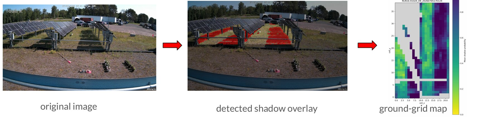
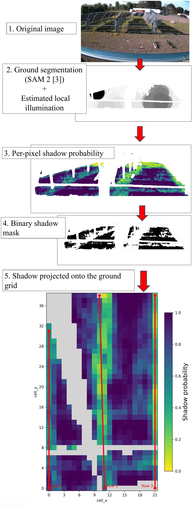
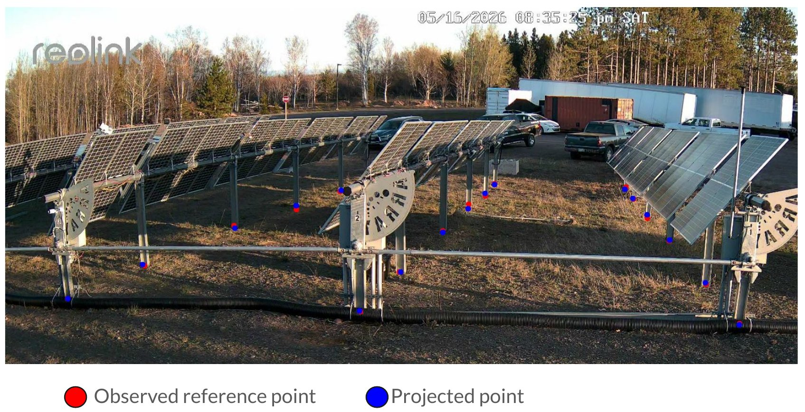
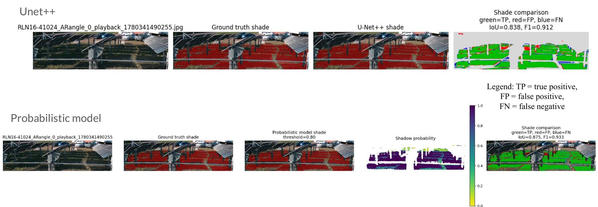
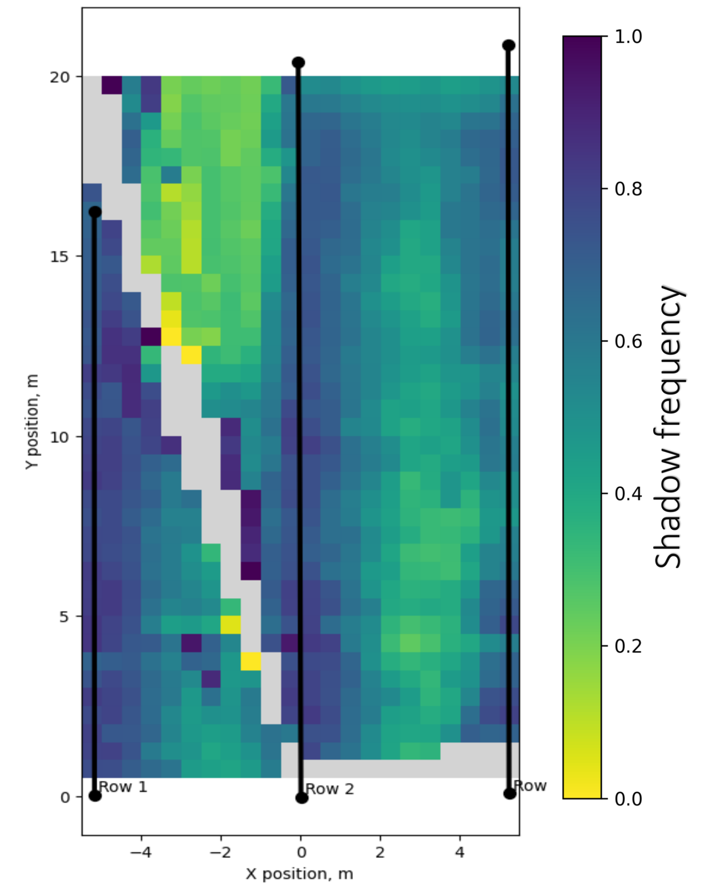
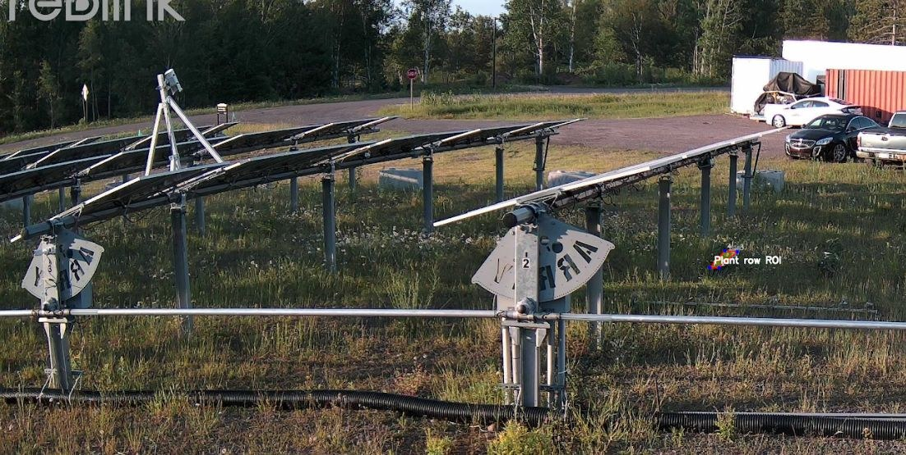

# Camera-Based Shadow Mapping for Agrivoltaics

**Author:** Alisa Teige, Department of Computer Science, Michigan Technological University<br>
**Faculty advisor:** Anna Stuhlmacher (Electrical and Computer Engineering)<br>
**Technical mentor:** Gabriel Draughon (Engineering Fundamentals)

This project estimates how much sun and shade the ground under and between solar panels receives over the day. It uses time-lapse images from a single fixed camera at an agrivoltaic site: it finds the ground, detects shadows in each image, projects them onto a real-world ground grid, and summarizes shade patterns for panel rows and individual plant beds.



## Why

Agrivoltaic systems grow crops under and between solar panels, so electricity generation has to be balanced against the light the plants need. Panel tracking strategies are usually fixed or pre-planned and are rarely checked against the shade that actually reaches the ground. Ray-tracing shade models need precise panel geometry and struggle with uneven terrain, obstructions and mounting hardware. A camera-based approach needs far fewer manual measurements and adapts directly to real field conditions.

**Site and data.** Images were collected at the DOE MI-RTC facility at Michigan Tech with a fixed Reolink fisheye camera looking at three single-axis PV rows and two aisles, every 10 minutes.

## Pipeline

Each image goes through ground segmentation, shadow detection and projection onto a 0.5 m ground grid. The results from all images are then combined into shade-frequency maps and sunlight-duration estimates. The scripts for each step are listed under [What each step does](#what-each-step-does).

<p align="center"></p>

## Results

### Camera calibration

Mean reprojection error: **6.77 pixels**, which is accurate enough to assign detected shadows to **0.5 m × 0.5 m** ground cells.



### Shadow detection: U-Net++ vs. probabilistic model

Two approaches were compared on 5 held-out, manually labeled images: a trained U-Net++ segmentation network [1] and a training-free probabilistic brightness-ratio model [2].

| Metric | U-Net++ | Prob. model |
|---|---|---|
| IoU | 0.73 | **0.75** |
| Mean absolute shaded-area error | **1.30%** | 2.64% |
| F1 | 0.84 | **0.85** |
| Precision | 0.85 | 0.85 |
| Recall | 0.82 | **0.85** |



- Both methods achieve similar detection accuracy, with slightly higher IoU and F1 for the probabilistic model.
- The probabilistic model needs no training data or manual labeling.
- U-Net++ estimates the total shaded area more accurately.
- The probabilistic model was selected for full-scale processing (this repository). The U-Net++ baseline is not included here.

### Shadow frequency map

<p align="center"></p>

- Computed from all valid daytime images, mid-May to mid-June 2026.
- Shade frequency is the fraction of daytime images in which a cell was classified as shaded (0.75 = shaded in 75% of images).
- The Row 2-3 aisle is shaded more often than the Row 1-2 aisle.
- The least-shaded zone is the middle of the Row 1-2 aisle.
- Gray cells are not visible to the camera or masked out.

### Sunlight duration for a plant row

The pipeline also estimates when a selected plant row is in direct sun and for how long. Example for 5 July 2026:



| Sunlit start | Sunlit end | Duration |
|---|---|---|
| 09:11 | 09:31 | 20 min |
| 15:21 | 18:31 | 3 h 10 min |

### Conclusions

- **Automated pipeline:** from camera images to ground shade maps.
- **Training-free:** accuracy comparable to U-Net++.
- **Spatial data:** shade frequency for every ground cell.
- **Next step:** compare with tracker control predictions.

## Repository structure

```text
├── scripts/                  # run these in order
│   ├── 01_create_metadata.py
│   ├── 02_create_sam_roi_masks.py
│   ├── 03_generate_shadow_probability_maps.py
│   ├── 04_project_to_ground_grid.py
│   ├── 05_make_summary_maps.py
│   ├── 06_bed_sun_exposure.py
│   └── findCoordinates.py    # helper: click on an image to get pixel coordinates
├── src/                      # reusable modules
│   ├── metadata.py           # timestamps from filenames, solar position, daytime filter
│   ├── sam_masks.py          # SAM ground masks + ROI + QC
│   ├── shadow_model.py       # shadow probability model
│   ├── camera_geometry.py    # camera model and ground-to-image projection
│   ├── ground_grid.py        # ground grid statistics
│   ├── panel_rows.py         # solar panel row locations
│   └── visualization.py      # figures
├── sample_data/
│   ├── images/               # 14 sample images (5 July 2026, 08:51-11:01)
│   └── camera_model/         # calibrated camera model (.npz)
├── sample_outputs/           # created when you run the pipeline
├── config_example.yaml       # main parameters in one place
└── requirements.txt
```

## Quick start

```bash
git clone <this-repo-url>
cd <repo-folder>
pip install -r requirements.txt

python scripts/01_create_metadata.py
python scripts/02_create_sam_roi_masks.py
python scripts/03_generate_shadow_probability_maps.py
python scripts/04_project_to_ground_grid.py
python scripts/05_make_summary_maps.py
python scripts/06_bed_sun_exposure.py
```

Paths are resolved relative to the repository, so the scripts can be run from any folder. Step 02 uses a SAM model through `ultralytics`; the model weights are downloaded automatically on first run.

The camera pose (`sample_data/camera_model/APS_SP_camera_model.npz`) was estimated with camera calibration code shared by Gabriel Draughon. Camera intrinsics are approximated from the horizontal field of view (70°) and a radial distortion coefficient (see `config_example.yaml`).

## What each step does

| Step | Script | What it does | Output |
|---|---|---|---|
| 1 | `01_create_metadata.py` | reads timestamps from filenames, adds solar elevation/azimuth, keeps daytime images | `sample_data/metadata/image_metadata_all.csv`, `image_metadata.csv` |
| 2 | `02_create_sam_roi_masks.py` | segments the visible ground with SAM, limits it to a fixed ROI, runs mask QC | `sample_data/masks/`, `sample_outputs/qc/` |
| 3 | `03_generate_shadow_probability_maps.py` | per-pixel shadow probability from an illumination-normalized image ratio, plus binary shadow masks | `sample_outputs/shadow_probability_maps/` (`.png` for viewing, `.npy` for analysis), `sample_outputs/pred_masks/` |
| 4 | `04_project_to_ground_grid.py` | projects each 50 cm ground cell into the image with the camera model and aggregates shadow statistics | `sample_outputs/grid_results/` |
| 5 | `05_make_summary_maps.py` | average shadow probability and shade-frequency maps with panel rows overlaid | `sample_outputs/figures/` |
| 6 | `06_bed_sun_exposure.py` | sunlit vs. shaded time and sunlit intervals for one plant bed | `sample_outputs/bed_sun_exposure/` |

## Adapting to a new camera view

Some coordinates are selected by hand. Run `python scripts/findCoordinates.py`, click on the image, and copy the printed pixel coordinates into:

```text
BED_POLYGON                     scripts/06_bed_sun_exposure.py
DEFAULT_SAM_POINTS              src/sam_masks.py
DEFAULT_PANEL_ROWS_PIXELS       src/panel_rows.py
ROI_X1, ROI_Y1, ROI_X2, ROI_Y2  scripts/02_create_sam_roi_masks.py
```

If the camera moves, update these values before rerunning the pipeline.

## Acknowledgments

Thanks to Gabriel Draughon for technical guidance throughout the project and for sharing the camera calibration code and helping adapt it for this setup, and to Anna Stuhlmacher for advising this research.

## References

1. Z. Zhou, M. M. Rahman Siddiquee, N. Tajbakhsh, and J. Liang, "UNet++: A nested U-Net architecture for medical image segmentation," *DLMIA/ML-CDS 2018*, LNCS vol. 11045, pp. 3–11. doi:10.1007/978-3-030-00889-5_1
2. A. Sanin, C. Sanderson, and B. C. Lovell, "Shadow detection: A survey and comparative evaluation of recent methods," *Pattern Recognition*, vol. 45, no. 4, pp. 1684–1695, 2012. doi:10.1016/j.patcog.2011.10.001
3. N. Ravi et al., "SAM 2: Segment anything in images and videos," arXiv:2408.00714, 2024.

## Contact

Alisa Teige, [alisateige@gmail.com](mailto:alisateige@gmail.com)
